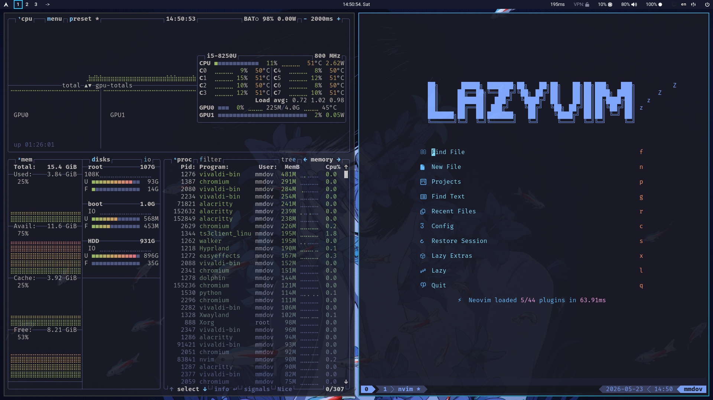
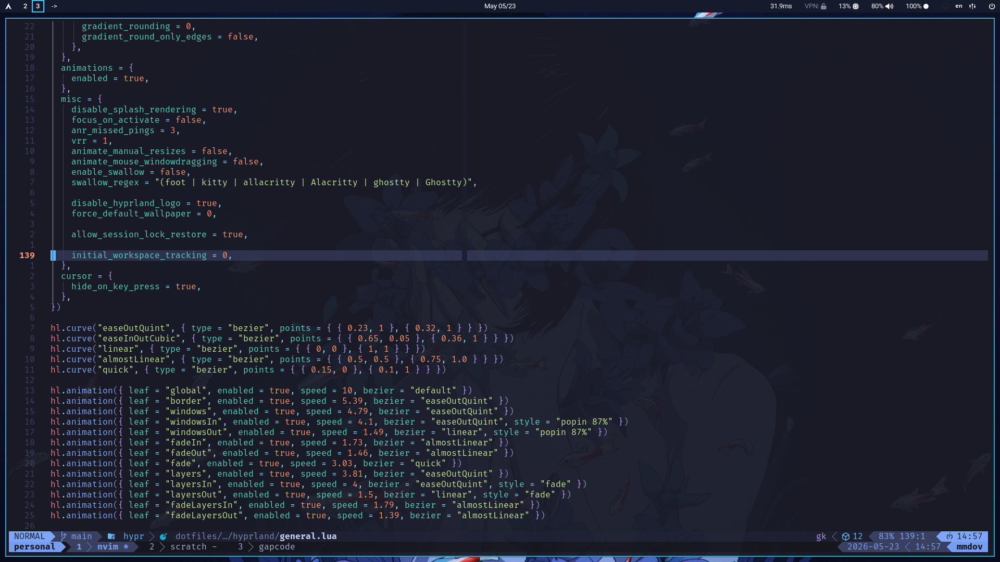
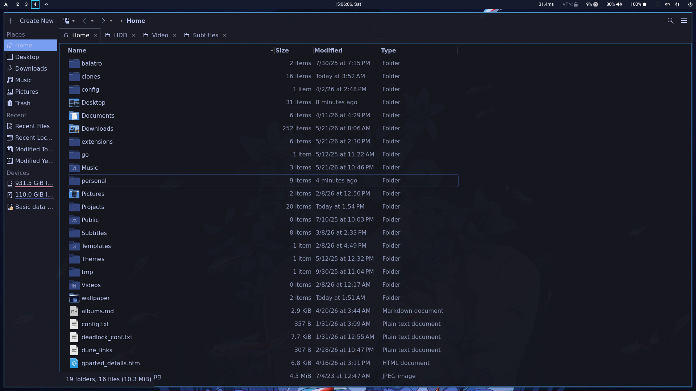

# دات‌فایل‌های شخصی لینوکس

> [!IMPORTANT]
> این مخزن در اصل برای استفاده شخصی خودم ساخته شده است. تنظیمات آن بر اساس سخت‌افزار، روند کاری، سلیقه‌ها و setup آرچ لینوکس من نوشته شده، پس قرار نیست یک نصب‌کننده آماده و ساده برای همه باشد. با این حال اگر خواستید می‌توانید از آن استفاده کنید، بخش‌هایی از آن را بردارید یا از ایده‌هایش الهام بگیرید؛ فقط قبل از اجرا روی سیستم خودتان حتما فایل‌ها و اسکریپت‌ها را بررسی کنید.

این یک مخزن شخصی برای راه‌اندازی Arch Linux و یک محیط دسکتاپ بر پایه Hyprland است.

این مخزن شامل تنظیمات Hyprland، Waybar، Neovim، tmux، Yazi، Kitty/Foot/Alacritty، SDDM، تم‌های GTK/Qt و چندین اسکریپت برای نصب برنامه‌ها و کپی کردن کانفیگ‌ها در مسیرهای مناسب است.

## تصویر محیط






## محتویات

- `assets/` - تصاویر و والپیپرها
- `dotfiles/` - فایل‌های تنظیمات سازمان‌دهی شده بر اساس مقصد نصب
  - `config/` - تنظیمات برنامه‌ها برای `~/.config/`
  - `local/` - فایل‌های محلی و desktop entry ها برای `~/.local/`
  - `system/` - فایل‌های سیستمی Arch مثل `pacman.conf` و `makepkg.conf`
- `install/` - اسکریپت‌های نصب سازمان‌دهی شده بر اساس دسته‌بندی
  - `core/` - نصب‌کننده‌های اصلی سیستم (pacman، paru، hyprland، nvim، tmux و غیره)
  - `desktop/` - نصب‌کننده‌های محیط دسکتاپ (sddm، theme)
  - `setup.sh` - اسکریپت اصلی هماهنگ‌کننده
- `scripts/` - اسکریپت‌های کمکی و ابزاری
  - `utils/` - ابزارهای روزمره (update-config، install، commitpush، sync_brain و غیره)
  - `helpers/` - اسکریپت‌های کمکی مستقل (vpn-bypass، ping-status و غیره)
- `themes/` - فایل‌های تم
  - `tokyonight-qt/` - فایل‌های تم Tokyonight برای Qt/Kvantum
  - `sddm/` - تنظیمات و فایل‌های تم SDDM
- `tmux/` - تنظیمات tmux و مدیریت session
  - `.tmux.conf` - فایل تنظیمات tmux
  - `sessionizer` - اسکریپت مدیریت session های tmux
  - `sessions/` - اسکریپت‌های راه‌اندازی session

## اسکریپت‌های اصلی

- `install/setup.sh` - اجرای ماژول‌های اصلی برای راه‌اندازی سیستم
- `scripts/utils/update-config.sh` - کپی کردن کانفیگ‌های داخل مخزن به مسیرهای محلی
- `scripts/utils/install.sh` - نصب یک پکیج با `paru` و کپی کردن کانفیگ مربوط به آن
- نصب‌کننده‌های جداگانه در `install/core/` مثل `hyprland.sh`، `nvim.sh`، `tmux.sh`، `pipewire.sh` و `bluetooth.sh` برای نصب و تنظیم بخش‌های مختلف سیستم

## روش استفاده

مخزن را در مسیر `~/personal` کلون کنید(و یا هر مسیری که دوست دارید این مسیر رو من خودم استفاده میکنم):

```bash
git clone https://github.com/MMDOV/dotfiles.git ~/personal
cd ~/personal
```

اول dry run اجرا کنید:

```bash
./install/setup.sh --dry-run
```

برای اجرای کامل نصب:

```bash
./install/setup.sh
```

برای اجرای فقط چند ماژول مشخص:

```bash
./install/setup.sh --only hyprland,nvim,tmux
```

برای رد کردن چند ماژول:

```bash
./install/setup.sh --skip drivers,sddm
```

برای کپی کردن کانفیگ‌ها بعد از تغییر دادن آن‌ها در مخزن:

```bash
./scripts/utils/update-config.sh
```

برای کپی کردن فقط یک پوشه کانفیگ، مثلا Neovim:

```bash
./scripts/utils/update-config.sh config nvim
```

## نکته‌ها

- این setup بیشتر برای Arch Linux نوشته شده و از `pacman` و `paru` استفاده می‌کند.
- بعضی اسکریپت‌ها به `sudo` نیاز دارند و ممکن است سرویس‌های سیستمی را فعال کنند.
- بعضی اسکریپت‌ها فایل‌های کانفیگ موجود را در مسیرهایی مثل `~/.config`، `~/.local` و `/etc` بازنویسی می‌کنند.
- قبل از اجرا روی یک سیستم جدید، بهتر است اسکریپت‌ها را بررسی کنید؛ مخصوصا `install/setup.sh`، `install/core/pacman.sh`، `install/core/drivers.sh` و `install/desktop/sddm.sh`.
- تمام اسکریپت‌ها اکنون از تشخیص `REPO_ROOT` استفاده می‌کنند و صرف‌نظر از محل کلون مخزن کار می‌کنند.

## نسخه انگلیسی

نسخه انگلیسی در [`README.md`](README.md) موجود است.
