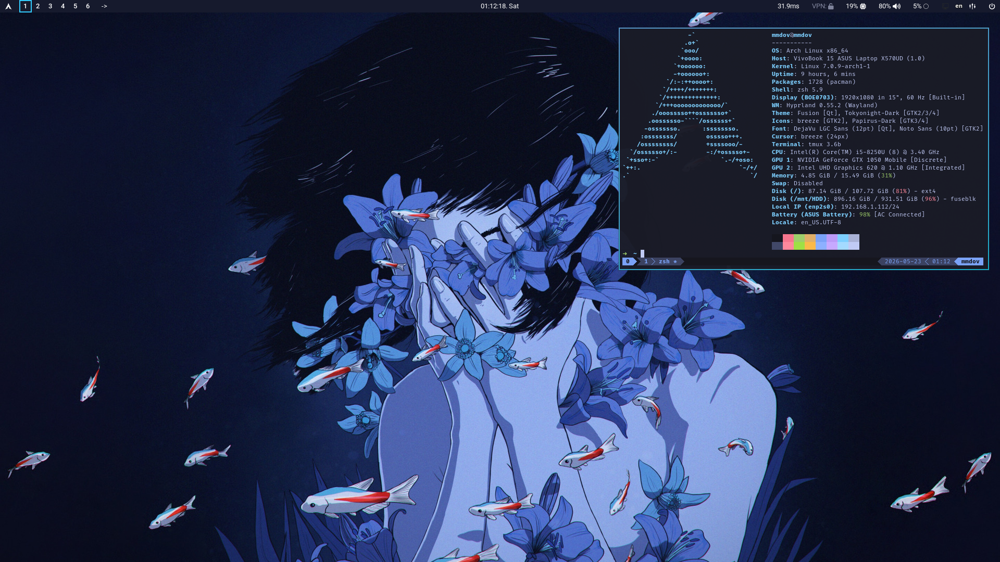

# Personal Linux Dotfiles

> [!IMPORTANT]
> This repository is mainly for my own personal use. It is tuned around my hardware, workflow, preferences, and Arch Linux setup, so it is not meant to be a polished one-command installer for everyone. Feel free to use it, copy parts of it, or take ideas from it, but please review everything before running it on your own machine.

A personal Arch Linux setup repository with configuration files and helper scripts for a Hyprland-based desktop environment.

This repo contains dotfiles for Hyprland, Waybar, Neovim, tmux, Yazi, Kitty/Foot, SDDM, GTK/Qt theming, and a collection of scripts to install packages and copy configs into the right places.

## Screenshot



## Persian README

A Persian version is available at [`README.fa.md`](README.fa.md).

## What's inside

- `assets/` - screenshots and wallpapers
- `dotfiles/` - configuration files organized by target location
  - `config/` - application configs for `~/.config/`
  - `home/` - home-directory files like `.tmux.conf`
  - `local/` - local binaries and desktop entries for `~/.local/`
  - `system/` - system-level Arch config files like `pacman.conf` and `makepkg.conf`
- `install/` - installation scripts organized by category
  - `core/` - core system installers (pacman, paru, hyprland, nvim, tmux, etc.)
  - `desktop/` - desktop environment installers (sddm, theme)
  - `setup.sh` - main orchestrator script
- `scripts/` - utility and helper scripts
  - `utils/` - daily utilities (update-config, install, commitpush, sync_brain, etc.)
  - `helpers/` - standalone helper scripts (vpn-bypass, ping-status, etc.)
- `themes/` - theme files
  - `tokyonight-qt/` - Qt/Kvantum Tokyonight theme files
  - `sddm/` - SDDM configuration and theme files
- `tmux/` - tmux configuration and session management
  - `.tmux.conf` - tmux configuration
  - `sessionizer` - tmux session manager script
  - `sessions/` - session initialization scripts

## Main scripts

- `install/setup.sh` - runs the main setup modules for a fresh system
- `scripts/utils/update-config.sh` - copies repo configs into the matching local locations
- `scripts/utils/install.sh` - installs a package with `paru` and copies its matching config
- Individual installers in `install/core/` like `hyprland.sh`, `nvim.sh`, `tmux.sh`, `pipewire.sh`, and `bluetooth.sh` install/configure specific parts of the system

## Usage

Clone the repo into `~/personal`:

```bash
git clone <repo-url> ~/personal
cd ~/personal
```

Run a dry run first:

```bash
./install/setup.sh --dry-run
```

Run the full setup:

```bash
./install/setup.sh
```

You can also run only specific modules:

```bash
./install/setup.sh --only hyprland,nvim,tmux
```

Or skip modules:

```bash
./install/setup.sh --skip drivers,sddm
```

To copy configs after editing them in the repo:

```bash
./scripts/utils/update-config.sh
```

To copy only one config folder, for example Neovim:

```bash
./scripts/utils/update-config.sh config nvim
```

## Notes

- This setup is mainly for Arch Linux and uses `pacman` and `paru`.
- Some scripts require `sudo` and may enable system services.
- Some scripts overwrite existing config files in places like `~/.config`, `~/.local`, and `/etc`.
- Review scripts before running them on a new machine, especially `install/setup.sh`, `install/core/pacman.sh`, `install/core/drivers.sh`, and `install/desktop/sddm.sh`.
- All scripts now use `REPO_ROOT` detection and work regardless of where the repo is cloned.
