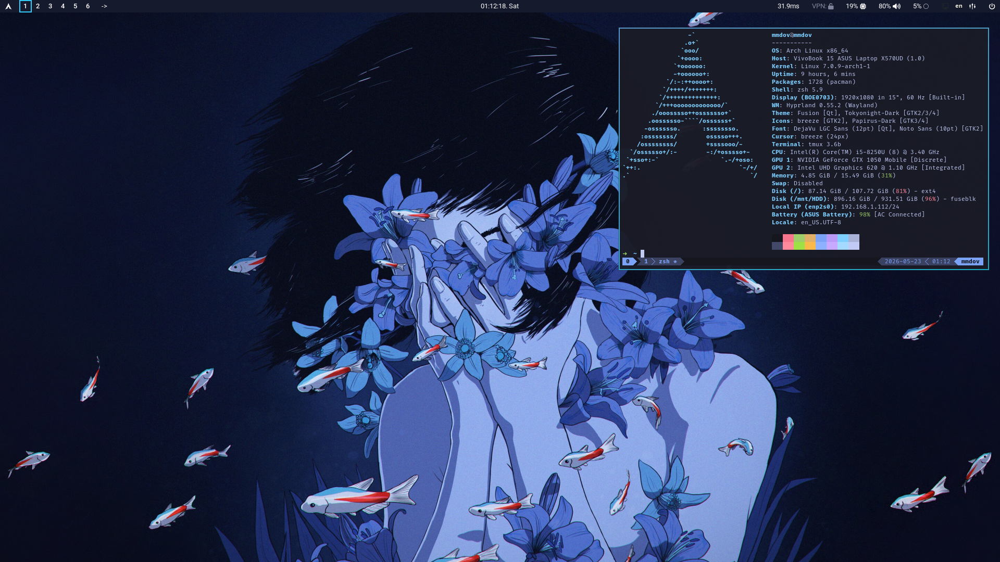
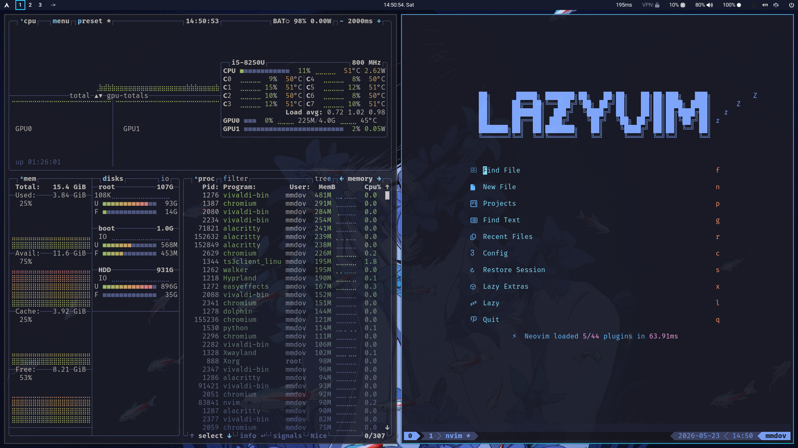
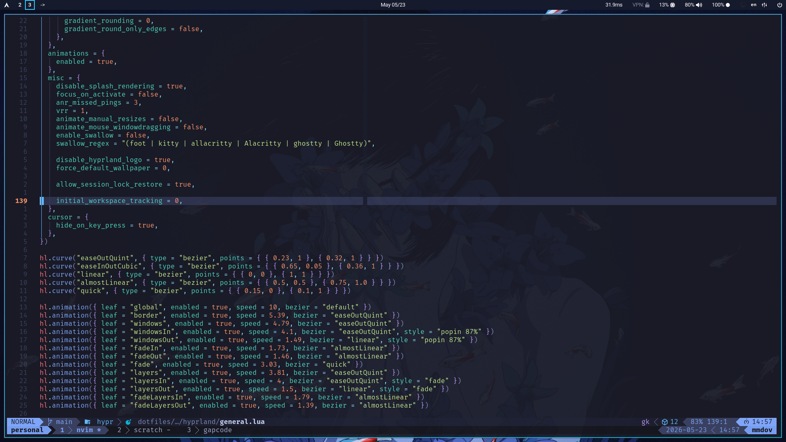
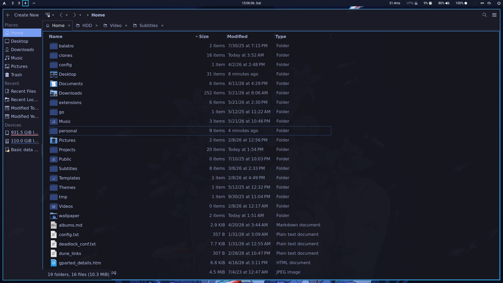

# Personal Linux Dotfiles

> [!IMPORTANT]
> This repository reflects my own workflow and taste. It is useful as a reference for Hyprland, Bash automation, and desktop orchestration, but review it before running on another machine.

A technical Arch Linux dotfiles repository for a Hyprland-based Wayland desktop. It combines modular desktop configuration, Lua-driven Hyprland rules, package installation scripts, local helper utilities, tmux session tooling, and GTK/Qt/SDDM theming into one reproducible setup.

The setup detects the machine it is running on rather than being told about it. Distro tier (vanilla Arch versus the CachyOS optimized repositories), GPU vendor, CPU capability, chassis, backlight and display layout are all discovered at runtime, so the same repository configures a laptop and a desktop without per-machine flags or branches.

## Screenshots

### Hyprland desktop



### Hyprland desktop 2



### Neovim editor



### Dolphin



## Prerequisites

This repository **configures** a system; it does not install one. Before running anything here, the following must already be true.

### Required

- **An Arch Linux or Arch-based system, already installed and booted.** CachyOS, EndeavourOS and similar all work. `install/core/base.sh` is a from-ISO `pacstrap` step and is deliberately excluded from the default run — bootloader, partitioning, locale and filesystem setup are all outside this repo's scope.
- **A regular user account with `sudo`**, not root. Modules write to `$HOME` and call `sudo` themselves for the few operations that need it; running the whole thing as root puts files in the wrong place.
- **A working network connection.** Every module installs packages.
- **`git`, `base-devel`, and `sudo` installed.** `base-devel` is needed to build `paru` from the AUR.
- **systemd.** The setup enables services and reads `hostnamectl`.

### Handled automatically

- **`multilib`** is enabled by the `pacman` module if it is not already. It is required for the 32-bit gaming libraries.
- **`paru`** is built by the `paru` module if it is missing.
- **`aria2`** is installed alongside the `makepkg` drop-in that depends on it.
- **The CachyOS repositories** are used when present. They are never added implicitly — pass `--with-cachyos` to add them via CachyOS's own installer. Without them the setup falls back to a vanilla Arch tier, which works but skips the optimized builds, `proton-cachyos-slr`, `chwd` and `game-performance`.

### Worth knowing before you run it

- **NVIDIA on vanilla Arch needs a decision.** Driver branch depends on GPU generation (`nvidia-open-dkms` for Turing and newer, a legacy branch such as `nvidia-580xx-dkms` for Maxwell/Pascal/Volta) and picking wrong leaves you without a display. The `drivers` module refuses to guess: it delegates to `chwd` when available and otherwise prints the options and your PCI IDs. AMD and Intel need no decision.
- **The clone path becomes `DOTFILES_ROOT`.** The `hyprland` module writes it into `~/.profile` as a managed block. Examples here assume `~/personal`.
- **It enables SDDM and NetworkManager**, and disables the system-wide `triggerhappy` unit in favour of a per-session one.
- **Display layout for a new machine.** Displays are matched on EDID description, so a machine with unknown monitors falls back to `preferred`/`auto` and comes up usable. To pin an arrangement, add the display to `dotfiles/config/hypr/hyprland/monitors.lua` using the `description:` string from `hyprctl monitors`.

Run `./scripts/utils/facts.sh --report` first. It tells you what the setup will detect and which tier it will pick, without changing anything.

## Architecture Overview

This repo is organized around a source-controlled copy of the Linux user environment:

- `dotfiles/config/` mirrors `~/.config/` for Hyprland, Waybar, Neovim, Yazi, terminal emulators, input methods, notifications, and application configs.
- `dotfiles/local/` mirrors `~/.local/` for desktop entries and user-level launchers.
- `dotfiles/home/` mirrors dotfiles that live directly under `~/` (e.g. `~/.claude/settings.json`).
- `dotfiles/system/` stores system configuration. `makepkg.conf.d/` holds drop-ins deployed to `/etc/makepkg.conf.d/`; `pacman.conf.reference` is a **read-only snapshot** that is never deployed, because `/etc/pacman.conf` is owned by the system and carries repositories this repo must not overwrite.
- `lib/facts.sh` is the hardware and distro detection layer. Every install module sources it and branches on capabilities rather than on a distro name.
- `install/core/` contains focused install modules for base packages, drivers, PipeWire, NetworkManager, environment, Hyprland, Neovim, tmux, gaming, and extras.
- `install/desktop/` contains display-manager and theme setup.
- `scripts/utils/` contains orchestration utilities for detection (`facts.sh`), drift reporting (`check-drift.sh`), config syncing, package installation, and Obsidian/brain workflows.
- `scripts/helpers/` contains standalone runtime helpers for VPN routing, file managers, Yazi, browser launchers, mounting, and GUI dialogs. These are invoked by keybinds and the compositor, not by the installer.
- `themes/`, `assets/`, and `tmux/` provide visual assets, screenshots, SDDM/Qt themes, tmux config, and session bootstrap scripts.

## Machine Detection

`lib/facts.sh` probes the system once and exposes `FACT_*` variables that the install modules branch on:

| Fact | Drives |
| --- | --- |
| CachyOS repositories present, and which tier (`v3` / `v4` / `znver4`) | which gaming stack and driver tooling is used |
| GPU vendor and DRM card ordering | driver packages, `AQ_DRM_DEVICES`, shader-cache variable |
| CPU vendor, thread count | microcode, and whether `game-performance` is worth using |
| Chassis, backlight device, battery | which keybind modules load |

The guiding rule is to gate on **capability, not distro name**: `pacman-conf --repo-list | grep -q cachyos` is truer than reading `ID=` from `/etc/os-release`, because it is also correct for vanilla Arch with the CachyOS repositories layered on top — which is what both of my machines actually run.

Detection is reported at the start and end of every `setup.sh` run. Silent degradation is the real failure mode of auto-detection, so the run states which tier it landed on and what followed from it.

## Hyprland Lua Migration

Since Hyprland 0.55 the compositor is configured in Lua rather than hyprlang. `hyprland.lua` is the entrypoint and imports focused modules under `dotfiles/config/hypr/`:

- `hyprland/general.lua` defines input behavior, gestures, layout defaults, borders, blur, shadows, and group styling.
- `hyprland/monitors.lua` declares displays, matched on **EDID description** rather than connector name.
- `hyprland/roles.lua` resolves primary/secondary roles from the connected displays and generates workspace placement from them.
- `hyprland/rules.lua` defines shared window behavior, then loads app-specific rule modules.
- `hyprland/execs.lua` registers startup orchestration through a `hyprland.start` hook for launcher services, input methods, clipboard history, authentication agents, network applets, terminals, browsers, file managers, and VPN-related workspaces.
- `hyprland/keybinds.lua` composes keybinding modules for window management, media keys, playback controls, and application shortcuts.
- `hyprland/apps/*.lua` separates advanced window rules by application domain: browsers, Steam/games, Discord/Vesktop, TeamSpeak, Spotify, terminals, VPN clients, QEMU, MPV, picture-in-picture overlays, RTL popups, Dolphin/Thunar progress dialogs, and Zenity/Tkinter windows.
- `hyprland/facts.lua` is **generated** by `scripts/utils/facts.sh --write-lua` and is not tracked. It lets the config branch on hardware without probing the system from inside the compositor.

This Lua layout makes the desktop configuration more programmable than plain Hyprland config. It uses structured function calls such as `hl.window_rule`, `hl.workspace_rule`, `hl.bind`, and `hl.exec_cmd` to express routing logic, reusable matchers, dynamic sizes/positions, special workspaces, startup placement, tags, opacity, pinning, floating behavior, and monitor-specific workspace defaults.

Examples of the routing model:

- Workspaces `1-3` land on the primary display and the rest on the secondaries, with the split resolved at runtime rather than pinned to connector names. Roles are recomputed on `monitor.added` / `monitor.removed`, so docking, undocking, and plugging in a TV all reassign correctly without a reload. With one display connected, everything collapses onto it.
- Browser windows are tiled on workspace `2`, while music web apps are routed to workspace `6`.
- Games and Steam app windows are routed to workspace `1` with full opacity and game-friendly behavior.
- Communication tools such as Discord, Vesktop, and TeamSpeak are routed to workspace `5`.
- VPN tools are tagged and routed to the named special workspace `special:vpn`.
- Picture-in-picture windows are tagged, floated, pinned, resized, and moved to a predictable screen position.

## Bash Orchestration

The setup flow is intentionally modular rather than a single monolithic installer:

- `install/setup.sh` detects `REPO_ROOT`, prints the detected machine, defines an ordered module list, supports `--dry-run`, `--only`, `--skip`, and `--with-cachyos`, and runs each install module from `install/core/` or `install/desktop/`.
- Install modules are grouped by responsibility so package installation, services, desktop components, and application setup can be tested independently.
- `scripts/utils/update-config.sh` copies tracked config trees into their runtime destinations and reloads Hyprland when available. It reports conflicting local edits before overwriting them.
- `scripts/utils/install.sh` ensures `paru` exists, installs a requested package, then copies the matching config folder.

### Idempotent by construction

There is no separate "update mode". Every module behaves the same on a fresh install and on the hundredth re-run, converging on the same state, because the already-configured path is the one exercised daily and must not be the less-tested branch. Steps that are genuinely first-run-only, such as `base`'s `pacstrap`, are gated on detection rather than on a flag.

In practice that means no module overwrites a system file it does not fully own, appends are delimited and replaced rather than repeated, and remote installers are fetched only when their target is missing. `./install/setup.sh` with no arguments is safe to run at any time.

## Main Commands

Clone the repository:

```bash
git clone https://github.com/MMDOV/dotfiles.git ~/personal
cd ~/personal
```

See what the machine is detected as:

```bash
./scripts/utils/facts.sh --report
```

Preview the setup without making changes:

```bash
./install/setup.sh --dry-run
```

Run the full setup:

```bash
./install/setup.sh
```

Add the CachyOS optimized repositories during setup. This is never implicit: it uses CachyOS's own `cachyos-repo.sh`, which picks the tier matching the CPU, and pulls in a forked `pacman` along with the `[cachyos]` repository.

```bash
./install/setup.sh --with-cachyos
```

Report where the live system has diverged from what the repo tracks:

```bash
./scripts/utils/check-drift.sh
```

Run only selected modules:

```bash
./install/setup.sh --only hyprland,nvim,tmux
```

Skip selected modules:

```bash
./install/setup.sh --skip drivers,sddm
```

Sync all configs after editing:

```bash
./scripts/utils/update-config.sh
```

Sync one config folder, for example Neovim:

```bash
./scripts/utils/update-config.sh config nvim
```

## Validation

There is no formal test suite because this is primarily system configuration, but the repo supports practical validation:

```bash
find scripts install lib -name '*.sh' -print0 | xargs -0 bash -n
find dotfiles/config/hypr -name '*.lua' -exec luac -p {} +
hyprctl reload
```

Recommended manual checks:

- Run `./install/setup.sh --dry-run` before a fresh install and confirm the reported tier matches expectations.
- Run `./install/setup.sh` twice in a row; the second run should report no changes. That is the acceptance bar for idempotency.
- After a `pacman` module run, confirm the repository blocks in `/etc/pacman.conf` are unchanged.
- Reload Hyprland after Lua or compositor changes.
- Test display changes both docked and undocked, and unplug/replug to confirm roles re-resolve.
- Open the affected application to verify workspace routing and window rules.
- Restart Waybar, tmux, or Neovim after editing their configs.
- Review scripts that use `sudo`, install packages, enable services, or overwrite files under `~/.config`, `~/.local`, or `/etc`.

## Notes

- Targets Arch Linux and Arch-based distributions, assuming `pacman`, `paru`, systemd, Wayland, and Hyprland. The CachyOS repositories are used when present and are not required.
- Some scripts enable services such as SDDM and NetworkManager.
- Machine-specific values are kept out of tracked files. They live in generated output (`hyprland/facts.lua`, `~/.config/uwsm/env-hyprland`) or are keyed on monitor description.
- Exactly one process-priority mechanism is ever active. `gamemode` and `ananicy-cpp` both rewrite process niceness and conflict, so the gaming module selects one based on CPU thread count and disables the other.
- A Persian version is available at [`README.fa.md`](README.fa.md).
